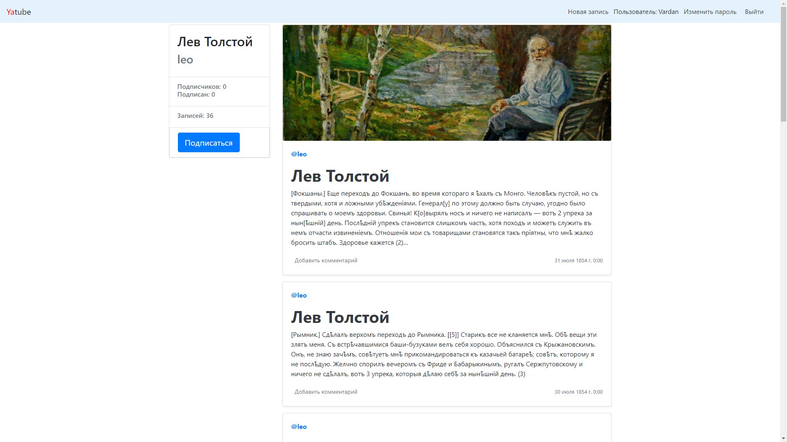

# YaTube

## Описание
Социальная сеть с возможностью ведения публичного дневника,
подписки на дневники других пользователей, добавления комментариев к записям дневника.
---
### Главная страница

### Страница пользователя


---
## Стек технологий
- проект написан на Python с использованием Django
- Bootstrap
- тестирование: Unittest
- кэширование
- базы данны - SQLite3
- система управления версиями - git

## Функционал проекта
- Может создать пост (текст + картинка)
- Редактировать или удалять свои посты
- Под любым постом оставлять комментарии
- Подписываться на других пользователей
- лента избранных авторов

## Как запустить проект:

1) Клонируйте репозиторий с проектом:
   ```
   https://github.com/GrimJ0/YaTube.git
   ```
2) В созданной директории установите виртуальное окружение, активируйте его и установите необходимые зависимости:
   ```
   python3 -m venv venv
   ```
   ```
   . venv/bin/activate
   ```
   ```
   pip install -r requirements.txt
   ```
3) Выполните миграции:
   ```
   python manage.py migrate
   ```
4) Cоздайте суперпользователя:
   ```
   python manage.py createsuperuser
   ```
5) Загрузите тестовые данные при необходимости:
   ```
   python manage.py loaddata dump.json
   ```
6) Запустите сервер:
   ```
   python manage.py runserver
   ```
С помощью Unittest вы можете запустить тесты и проверить работу модулей:
   ```
   python manage.py test
   ```

Ваш проект запустился на http://127.0.0.1:8000/
